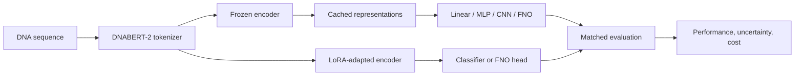

# DNABERT2-FNO-Benchmark

**DNABERT-2의 적응 방법과 장거리 서열 활용을 비교하는 유전체 모델 벤치마크**

> Controlled comparisons of Fourier neural operators, convolution, attention, and LoRA for genomic prediction.

이 프로젝트는 사전학습된 DNA 언어모델에 Fourier Neural Operator(FNO)를 결합했을 때 얻는 이득을 검증한다. 단순한 분류기와 비교하는 데서 출발해, 학습 파라미터 수가 비슷한 MLP·CNN, encoder를 직접 적응시키는 LoRA, 긴 입력을 처리하는 attention으로 비교 범위를 확장했다. 구현 자체보다 **어떤 조건에서 개선이 나타나고, 강한 비교군을 포함했을 때 결론이 유지되는지**를 중심으로 실험을 구성했다.

| 항목 | 내용 |
|---|---|
| 연구 분야 | Genomic language model, parameter-efficient adaptation, sequence modeling |
| 기반 모델 | DNABERT-2 |
| 주요 기술 | Python, PyTorch, Transformers, FNO, LoRA, scikit-learn |
| 평가 대상 | Promoter 분류, enhancer–promoter 관계, CRISPR 후보 순위, 장거리 발현 예측 |
| 공개본 상태 | 모델·학습 코드, 실험 설정, 대표 결과와 회귀 테스트 포함 |

## 1. 해결하려는 문제

Frozen encoder 위에 새 모듈을 추가하면 적은 학습 비용으로 성능을 높일 수 있다. 그러나 선형 분류기보다 좋아졌다는 사실만으로 새 연산의 효과를 설명하기는 어렵다. 파라미터 수 증가, pooling 방식, 입력 구성, 학습률 선택이 결과에 영향을 줄 수 있기 때문이다.

이 저장소에서는 다음 질문을 구분한다.

1. FNO의 개선이 유사한 크기의 MLP·CNN과 비교해도 유지되는가?
2. Frozen feature에 연산을 추가하는 방법과 LoRA로 encoder를 적응시키는 방법의 차이는 무엇인가?
3. LoRA와 FNO를 결합하면 추가 비용에 맞는 일관된 이득이 생기는가?
4. 입력 길이를 늘렸을 때 모델이 실제로 원거리 정보를 활용하는가?
5. 예측 성능의 작은 차이를 계산 비용·불확실성과 함께 해석하면 어떤 선택이 타당한가?

## 2. 구현 구조



Frozen 경로에서는 encoder 표현을 미리 계산하고 후단 모델을 학습한다. LoRA 경로에서는 encoder 내부의 적응 파라미터를 학습한다. 따라서 후단 학습의 메모리·시간과 encoder를 포함한 전체 추론 비용을 나누어 기록한다. Cache를 사용한 학습 시간만 비교해 전체 시스템이 더 빠르다고 해석하지 않는다.

## 3. 비교 설계

| 비교 | 확인하려는 요인 |
|---|---|
| Frozen + linear | 사전학습 표현의 기본 분류 성능 |
| Frozen + MLP / CNN | 추가 용량과 지역적 서열 처리의 효과 |
| No-spectral 변형 | Fourier 연산을 제외한 구조적 대조 |
| Frozen + FNO | 고정 표현 위에서의 spectral mixing |
| LoRA | Encoder 자체의 parameter-efficient adaptation |
| LoRA + FNO | Encoder 적응과 후단 mixing의 추가 효과 |

Promoter 주 비교는 **하나의 고정 split에서 seed 42–46을 반복**한 결과다. 5-fold 교차검증과는 다르다. Exact/역상보 서열 중복을 처리한 split과 dev 기반 설정 선택을 사용했으며, 상세한 데이터 처리·학습률 선택·비용 계측 범위는 [비교 프로토콜](docs/COMPARATIVE_PROTOCOL.md)에 기록되어 있다.

## 4. 대표 결과

### Promoter 분류

동일한 **604개 test 서열**에서 얻은 seed 평균 ± sample SD다. 주 결과는 BF16 모델이며 LoRA 병합 전 상태의 평가다.

| 모델 | 학습 파라미터 수 | Test MCC |
|---|---:|---:|
| Frozen + linear | 1,538 | 0.3315 ± 0.0189 |
| Frozen + MLP | 237,224 | 0.4181 ± 0.0259 |
| No spectral, width 64 | 106,499 | 0.4265 ± 0.0268 |
| Frozen + CNN | 236,423 | 0.4201 ± 0.0173 |
| Frozen + FNO | 237,571 | **0.4805 ± 0.0197** |
| LoRA | 222,722 | **0.6014 ± 0.0223** |
| LoRA + FNO | 458,755 | **0.6059 ± 0.0169** |

FNO는 frozen 비교군보다 높은 MCC를 보였지만, LoRA는 FNO보다 **5/5 seed**에서 좋았다. LoRA+FNO의 LoRA 대비 평균 차이는 **+0.0045 ± 0.0170**이고, 개선은 **3/5 seed**에서만 관찰됐다. 따라서 조합 모델의 추가 파라미터와 추론 비용을 정당화하는 일관된 개선은 확인하지 못했다. [전체 지표와 비용](docs/COMPARATIVE_RESULTS.md), [집계 JSON](docs/comparative_results/summary.json)


### 장거리 입력

연속 DNA 입력을 사용한 비교에서 FNO의 macro Pearson은 **4 kb의 0.7026에서 64 kb의 0.7172로 증가**했다. 같은 64 kb 조건의 CNN은 **0.7172**, attention은 **0.7215**였다. 입력 길이에 따른 탐색적 개선과, 특정 모델이 다른 구조보다 우수하다는 주장은 구분해야 한다. [장거리 프로토콜](docs/CONTINUOUS_RNA_PROTOCOL.md), [결과·불확실성](docs/CONTINUOUS_RNA_RESULTS.md)


### 후속 진단

CRISPR 후보 순위 및 enhancer–promoter 실험에서는 거리 정보, 입력 구성, pooling, 비교군 용량의 영향을 분리해 살펴본다. 각각의 데이터 조건과 결론은 [CRISPR 결과](docs/CRISPR_RANKING_RESULTS.md), [입력 정보 진단](docs/EPI_INFORMATION_RESULTS.md), [거리 통제 비교](docs/MATCHED_CV_RESULTS.md)를 참고한다.

## 5. 설치와 실행

기록된 실행 환경과 맞추려면 **Python 3.12**를 권장한다.

```bash
git clone https://github.com/CHOMINWOO1/DNABERT2-FNO-Benchmark.git
cd DNABERT2-FNO-Benchmark
python -m venv .venv
```

가상환경을 활성화한 뒤 실행한다. Windows PowerShell은 `.\.venv\Scripts\Activate.ps1`, macOS/Linux는 `source .venv/bin/activate`를 사용한다.

```bash
python -m pip install -e ".[test]"
python -m pytest tests -q
```

테스트는 사전학습 모델을 내려받지 않고 구성 요소를 검사한다. 전체 학습에는 데이터와 DNABERT-2 가중치 준비가 필요하다. [준비 코드](scripts/prepare_data.py)와 [backbone 확인 코드](scripts/check_backbone.py)를 검토하고, 각 프로토콜에 맞는 설정을 사용한다. 원시 데이터·feature cache·학습 checkpoint는 공개 저장소에 포함하지 않았다.

## 6. 코드 안내

| 위치 | 역할 |
|---|---|
| [dnabert_fno/](dnabert_fno/) | 모델, encoder 로딩, 데이터와 학습 구성 요소 |
| [configs/](configs/) | 비교 실험과 입력 길이별 설정 |
| [scripts/](scripts/) | 데이터 준비, 실험 실행, 검증과 결과 시각화 |
| [tests/](tests/) | 모델·적응 방식·실험 관련 회귀 테스트 |
| [docs/](docs/) | 프로토콜, 결과 해석, 대표 그림과 집계 자료 |

## 7. 검증 범위와 한계

공개 파일만 추출한 별도 디렉터리에서 **46개 테스트가 통과**했다. 이는 구현 검증이며, README에 인용한 학습 결과를 다시 계산한 것은 아니다. 성능 수치는 기존 실험 기록에 근거한다.

결과는 데이터·split·학습 예산·하드웨어 조건에 의존한다. 일부 분석은 탐색적이며 다중 비교 미보정 구간을 포함한다. FNO의 전반적 우위, Fourier 연산의 생물학적 메커니즘, 다른 유전체 과제에 대한 일반화는 현재 결과만으로 확정하지 않는다.

## 8. 이 저장소에서 확인할 수 있는 작업

동일 조건의 비교군 구현, dev/test 역할 분리, seed 반복, 비용 계측, 강한 비교군을 반영한 결론 수정이 핵심이다. 모델을 추가하는 작업뿐 아니라, 추가 복잡성을 유지할 근거가 있는지 평가한 과정을 문서와 코드로 남겼다.


## 시각화된 결과와 진행 상태


[상세 결과·진행 상태·보완 과제·보안 범위](docs/portfolio-results/README.md)에서 근거 자료와 재현 코드를 확인할 수 있다.

## 공개 범위와 추가 문서

이 저장소는 원래 작업 폴더에서 핵심 코드·테스트·설정·작은 예제·대표 결과를 선별한 공개본이다. 대용량 데이터·가중치, 인증정보, 내부 실행 기록과 중복 문서 생성 산출물은 제외했다. 기존 논문·실험 수치는 기록된 결과이며 이번 README 개정에서 재측정하지 않았다.

- [실행한 검증과 한계](VALIDATION.md)
- [공개본 구성과 재사용 조건](PUBLICATION_NOTES.md)
- [인증정보와 로컬 설정 관리](SECURITY.md)

초기 공개본에는 별도 오픈소스 재사용 라이선스를 부여하지 않았다. 제3자 모델·데이터·의존성은 각 원 출처의 이용 조건을 따른다.
