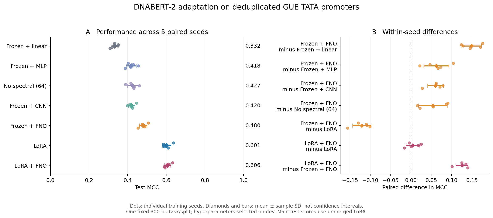

# DNABERT-2: FNO, 용량 대조군, LoRA 비교 결과

이번 조건에서는 **LoRA 단독을 우선 선택하는 것이 타당하다.** Frozen FNO는 선형 분류기와 비슷한 parameter 수의 MLP/CNN보다 좋아졌지만, LoRA보다 낮았다. LoRA+FNO는 LoRA에 비해 평균 MCC가 0.0045 높았을 뿐이고, 5개 seed 중 3개에서만 개선됐다. 추가 parameter와 추론 비용을 정당화하는 일관된 이득은 확인하지 못했다.

2026-09-08, NVIDIA RTX 5060 Ti 8GB, CUDA 12.8, BF16에서 실행했다. **42개 training trial 및 선택된 35개 checkpoint의 test 평가를 모두 완료**했다. 본 실행은 14:42:07–16:12:02 KST, 약 89.9분이었다. 이 시간에는 학습·dev·checkpoint 처리·test 평가가 포함되며, 사전 환경 구성과 후속 검증은 제외된다.

## Test 성능

동일한 604개 test 서열에서 seed 42–46의 평균 ± sample SD다. 5-fold 교차검증이 아니라 **하나의 고정 split에서 5개 학습 seed**를 비교했다. 주 결과는 학습된 BF16 모델이며 LoRA는 병합 전 상태다. Accuracy/F1/AUC는 0–1 단위다. PR-AUC는 PR 곡선의 사다리꼴 면적이고 average precision은 별도로 저장했다.

| 모델 | 학습 parameter | Accuracy | F1 | MCC | ROC-AUC | PR-AUC |
|---|---:|---:|---:|---:|---:|---:|
| Frozen + linear | 1,538 | 0.6656 ± 0.0093 | 0.6741 ± 0.0131 | 0.3315 ± 0.0189 | 0.7175 ± 0.0083 | 0.7137 ± 0.0075 |
| Frozen + MLP | 237,224 | 0.7046 ± 0.0149 | 0.7195 ± 0.0284 | 0.4181 ± 0.0259 | 0.7826 ± 0.0122 | 0.7714 ± 0.0116 |
| No spectral, width 64 | 106,499 | 0.7109 ± 0.0132 | 0.7319 ± 0.0126 | 0.4265 ± 0.0268 | 0.7759 ± 0.0156 | 0.7611 ± 0.0145 |
| Frozen + CNN | 236,423 | 0.7096 ± 0.0084 | 0.7136 ± 0.0174 | 0.4201 ± 0.0173 | 0.7783 ± 0.0067 | 0.7709 ± 0.0098 |
| Frozen + FNO | 237,571 | 0.7387 ± 0.0100 | 0.7516 ± 0.0123 | 0.4805 ± 0.0197 | 0.8188 ± 0.0074 | 0.8101 ± 0.0087 |
| LoRA | 222,722 | 0.7993 ± 0.0119 | 0.8074 ± 0.0096 | 0.6014 ± 0.0223 | 0.8815 ± 0.0051 | 0.8859 ± 0.0025 |
| LoRA + FNO | 458,755 | 0.8023 ± 0.0087 | 0.7994 ± 0.0113 | 0.6059 ± 0.0169 | 0.8840 ± 0.0097 | 0.8909 ± 0.0113 |

원자료: [집계 JSON](comparative_results/summary.json), [35개 run별 수치](comparative_results/all_runs.csv), [학습 및 평가 프로토콜](COMPARATIVE_PROTOCOL.md).



## 무엇이 확인됐는가

| 같은 seed에서의 MCC 차이 | 평균 ± SD | 양의 차이를 보인 seed |
|---|---:|---:|
| FNO − linear | +0.1489 ± 0.0239 | 5/5 |
| FNO − MLP | +0.0624 ± 0.0307 | 5/5 |
| FNO − CNN | +0.0604 ± 0.0194 | 5/5 |
| FNO − no-spectral | +0.0539 ± 0.0351 | 5/5 |
| LoRA − FNO | +0.1209 ± 0.0223 | 5/5 |
| LoRA+FNO − LoRA | +0.0045 ± 0.0170 | 3/5 |

**FNO의 개선을 parameter 증가만으로 설명하기는 어렵다.** MLP/CNN은 FNO와 parameter 수가 1% 이내인데도 FNO가 매 seed에서 더 좋았다. 다만 bottleneck 폭과 구조가 다르므로 Fourier 연산의 특정 생물학적 메커니즘을 입증한 것은 아니다. No-spectral은 더 작은 모델이어서 그 비교만으로 용량 효과를 제거할 수 없다.

**LoRA 비교가 연구 결론에 중요했다.** LoRA는 FNO보다 학습 parameter가 약 6.3% 적으면서도 MCC가 평균 0.1209 높았다. 선형 baseline을 이겼다는 사실만으로 기존 parameter-efficient adaptation보다 우수하다고 주장할 수 없다.

**LoRA에 FNO를 추가할 근거는 현재 약하다.** 평균 MCC 차이 0.0045보다 seed별 차이의 SD 0.0170이 크며, 2개 seed에서는 오히려 낮았다. Accuracy는 0.30 percentage point 높지만 F1은 낮아 지표 전반의 일관된 개선도 아니다. 조합 모델의 parameter 수는 LoRA 단독의 약 2.06배다. 유의성이나 두 구조의 상보성을 확립한 결과로 해석하지 않는다.

학습률 선택에 사용한 seed 42를 제외해도 같은 양상이었다. Seed 43–46의 평균 MCC는 FNO 0.4738, LoRA 0.5925, LoRA+FNO 0.5993이다. 조합 − LoRA 차이는 +0.0068 ± 0.0187, 양의 차이는 3/4였다. [추가 집계](comparative_results/supplementary.json)에 전체 수치를 저장했다.

## 학습 비용과 GPU 사용량

학습 시간은 선택된 5개 run의 평균 ± SD이며 **train 단계만** 포함한다. Dev 평가, 모델 로딩, checkpoint I/O, 공유 feature cache 생성 비용은 포함하지 않는다. 추론은 동일한 160개 서열, batch 8, 전체 encoder+head, H2D 포함, tokenizer/disk 제외다. LoRA 추론 속도는 병합 후 모델에서 측정했다.

| 모델 | Train 시간/run (초) | Train peak allocated (MiB) | 추론 (서열/초) |
|---|---:|---:|---:|
| Frozen + linear | 27.5 ± 7.1 | 68.4 | 490.7 |
| Frozen + MLP | 41.5 ± 9.4 | 80.9 | 339.2 |
| No spectral | 38.0 ± 10.4 | 78.1 | 339.3 |
| Frozen + CNN | 49.5 ± 22.6 | 80.8 | 323.5 |
| Frozen + FNO | 46.8 ± 6.3 | 80.4 | 306.3 |
| LoRA | 240.7 ± 39.0 | 1,012.3 | 496.1 |
| LoRA + FNO | 347.6 ± 97.8 | 1,018.5 | 311.7 |

Frozen 모델의 작은 train 메모리는 **encoder 표현을 미리 계산한 뒤 cache로 학습한 값**이다. 공유 cache 생성에는 12.73초, peak allocated 515.4 MiB가 필요했다. LoRA는 매 batch online forward/backward를 수행한다. PyTorch allocated 메모리는 OS·화면·CUDA context를 포함한 `nvidia-smi` 전체 VRAM과 다르다. 실행 중 LoRA 단계에서 전체 VRAM은 약 2.8GB로 관측됐다. 전체 모델의 inference peak allocated는 약 545–547 MiB였다.

FNO는 공유 cache가 있을 때 LoRA보다 train 시간이 약 5.1배 짧았다. 반면 병합한 LoRA는 FNO보다 높은 추론 처리량을 보였다. LoRA+FNO는 LoRA보다 train 시간이 약 44% 길고 추론 처리량은 약 37% 낮았다. 이는 이 구현과 단일 GPU 세션에서의 측정이며 서로 다른 세션에서 반복 측정한 속도 보장은 아니다.

탈락한 LR pilot 7개까지 포함한 전체 42개 trial의 train 시간 합계는 4,768.1초다. 방법별 pilot 비용과 train+dev 시간도 [추가 집계](comparative_results/supplementary.json)에 별도로 기록했다.

## LoRA 병합과 정밀도 확인

BF16에서 병합 전후의 평균 점수 차이는 작았지만, 일부 개별 확률 차이는 컸다. LoRA는 seed별 1–4/604개, LoRA+FNO는 1–9/604개의 분류 결과가 달라졌다. 최대 절대 확률 차이는 각각 0.1202와 0.7760이었다. 따라서 병합 전후 BF16 예측을 동일하다고 취급하지 않는다.

| 상태 | LoRA MCC | LoRA+FNO MCC |
|---|---:|---:|
| 주 결과: BF16, 병합 전 | 0.6014 ± 0.0223 | 0.6059 ± 0.0169 |
| 추론용 BF16, 병합 후 | 0.5994 ± 0.0209 | 0.6065 ± 0.0169 |
| 후속 수치 검사: FP32, 병합 전 | 0.6019 ± 0.0216 | 0.6045 ± 0.0182 |

이 차이를 확인하기 위해 학습된 **10개 LoRA checkpoint × 전체 604개 test 서열**을 FP32/TF32-off에서 추가 검사했다. FP32 병합 전후 최대 절대 확률 차이는 **0.00002542**, 분류 결과 변화는 **0개**였다. 이번 검사 결과는 BF16의 연산·반올림 차이에 대한 예측 민감도를 뒷받침한다. 이는 수치 검사용 후속 평가이며, 학습률·checkpoint를 다시 선택하거나 주 결과를 교체하지 않았다. FP32에서도 조합의 평균 MCC 이득은 약 0.0026으로 작았다. [실제 checkpoint 정밀도 검사](comparative_results/merge_precision_check.json)를 참고한다.

## 데이터와 해석 범위

- GUE `prom_300_tata`의 기존 6,130개 row에서 exact/RC 그룹을 만들고, 상충 label을 가진 15개 그룹을 제외했다. 일관된 중복 그룹은 하나만 남겨 6,036개가 됐다.
- 고정 split seed 20260908로 train 4,828 / dev 604 / test 604를 구성했다. Split 사이 exact/RC 중복은 0개다. Test는 양성 303, 음성 301개다.
- 같은 데이터셋을 재분할한 결과이며 외부 검증이 아니다. 근접 상동성, 염색체 분리, 사전학습 데이터 중복은 통제하지 않았다. [데이터 출처와 감사 기록](comparative_results/data_source.json), [원본 row 대응표](comparative_results/data_assignment.json)를 보관했다.
- 첫 PoC와 test split이 다르므로 그때의 MCC 0.5657과 이번 FNO 평균 0.4805의 차이를 중복 제거 효과나 성능 퇴보로 해석하면 안 된다.
- 실제 서열은 모두 300 bp이고 BPE token 수는 special token 포함 47–76이다. 512는 token 상한일 뿐이며, 긴 서열 일반화나 해상도 불변성을 시험한 실험은 아니다. FNO의 Fourier 축도 균등한 bp 좌표가 아닌 BPE token index다.
- LoRA는 12개 fused `Wqkv`에 rank 6, alpha 12, dropout 0.1을 적용한 구현이다. Q/V-only 또는 세 개의 독립 rank-6 LoRA와 다르다. 모든 원본 가중치는 고정했다.
- 방법별 LR 후보는 두 개뿐이고, seed 42의 dev MCC로 선택했다. 나머지 seed에서는 변경하지 않았다. 선택된 LR은 linear 0.001, 나머지 방법 0.0003이며 LoRA 방법의 head/FNO LR은 항상 0.001이었다.
- 32-row engineering smoke 실행은 실행·checkpoint·merge 확인용이었다. 그 점수로 구조나 학습률을 선택하지 않았다. 정식 604-row test metrics는 전체 학습을 마친 뒤 계산했다.
- Seed SD는 학습 변동이며 dataset 표본 불확실성의 신뢰구간이 아니다. 이 결과는 하나의 짧은 promoter task와 제한된 탐색 범위에 해당한다.

## 검증 및 재현 파일

모듈 테스트 **25개가 통과**했다. Padding/batch 불변성, LoRA gradient 및 merge, parameter 수, 중복/상충 label 처리, 마지막 gradient accumulation 정규화, checkpoint 중단·재개 등을 포함한다. 단일 class metric 테스트에서 발생한 예상된 sklearn warning 1개 외 실패는 없었다. [테스트 기록](comparative_results/pytest.txt).

저장된 35개 run × 604개 예측에 대해 row ID/label, 6개 지표 재계산, confusion count 기반 MCC, paired 차이, 평균/SD, source/data/checkpoint SHA256을 검사했다. 모든 trial에서 원본 가중치 고정과 seed별 초기 head/LoRA 값 일치도 확인했다. [검증 결과](comparative_results/verification.json).

- [고정 프로토콜과 코드 hash](comparative_results/protocol.json)
- [학습률 선택 기록](comparative_results/selection.json)
- [학습 곡선](comparative_results/learning_curves.png)
- [내보낸 180개 원자료 파일의 manifest](comparative_results/export_manifest.json)
- 학습 checkpoint는 `runs/comparative_study/trials/`, 예측값은 `runs/comparative_study/results/`에 있다. 작은 원자료 사본은 이 문서와 함께 `docs/comparative_results/`에 보관했다. 큰 가중치와 feature cache는 복제하지 않았다.

```powershell
.\.venv\Scripts\python.exe -m dnabert_fno.study
.\.venv\Scripts\python.exe -m pytest -q
.\.venv\Scripts\python.exe scripts/verify_study.py
.\.venv\Scripts\python.exe scripts/plot_study.py
.\.venv\Scripts\python.exe scripts/export_study.py
.\.venv\Scripts\python.exe scripts/check_study_merge_precision.py
```

## 다음 실험의 우선순위

현재 성능 비교의 기준선은 LoRA로 두고, FNO는 적은 학습 비용으로 frozen representation을 개선하는 방법으로 평가하는 것이 이 결과에 부합한다. 연구 주장을 넓히려면 다른 GUE task와 상동성/염색체를 통제한 분할에서 LoRA 대비 결과가 재현되는지가 우선이다.

LoRA+FNO 조합을 계속 연구한다면 LoRA+MLP 또는 LoRA+CNN, 그리고 더 높은 rank의 LoRA로 추가 용량을 통제해야 한다. 현재 fused-QKV 정의에서 rank 12 LoRA+head는 443,906 parameter로 조합 모델의 458,755에 가깝다. 이들은 후속 제안이며 이번 실행에는 포함하지 않았다. LoRA의 구성 근거는 [원 논문](https://arxiv.org/abs/2106.09685)과 [공식 구현](https://github.com/microsoft/LoRA), backbone은 [DNABERT-2 공식 저장소](https://github.com/MAGICS-LAB/DNABERT_2)를 참고한다.
