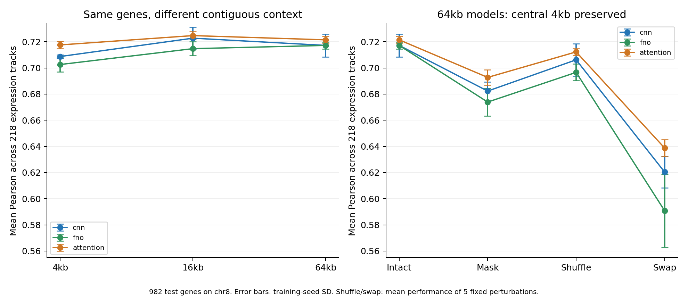

# 연속 DNA 4/16/64kb에서 DNABERT-2 + FNO 비교

**완료: 원거리 입력을 예측에 사용하는 신호는 관찰했지만, FNO의 고유한 성능·속도 우위는 확인하지 못했다.** FNO의 64kb−4kb macro Pearson 차이는 +0.0146, 조건부 95% bootstrap 구간은 [+0.0014, +0.0284]였다. 그러나 64kb에서 FNO−CNN은 약 0, FNO−attention은 −0.0043이며 두 구간 모두 0을 포함한다. 64kb가 16kb보다 낫다는 근거도 충분하지 않다.

이번 결과는 실제 연속 DNA에서 얻었다. 기존 enhancer–promoter 분류·CRISPR 후보 순위 실험과 데이터 및 지표가 달라 수치를 직접 비교할 수 없다. [사전 실험 프로토콜](CONTINUOUS_RNA_PROTOCOL.md)과 [별도 추론 시간 프로토콜](CONTINUOUS_RNA_TIMING_PROTOCOL.md)에 따라 실행했다.

## 예측 성능

Test는 chr8의 유전자 982개, 발현 출력 218개다. 각 출력별로 유전자 간 Pearson을 계산하고 218개를 평균한 **macro Pearson**을 사용했다. 표는 학습 seed 42/43/44의 평균 ± 표본 표준편차이며, 표준편차는 신뢰구간이 아니다. 길이 표기 4/16/64kb의 실제 입력은 4,096/16,384/65,536bp다.

| Model | 4kb | 16kb | 64kb |
|---|---:|---:|---:|
| cnn | 0.7087 ± 0.0014 | 0.7228 ± 0.0086 | 0.7172 ± 0.0087 |
| fno | 0.7026 ± 0.0057 | 0.7148 ± 0.0054 | 0.7172 ± 0.0027 |
| attention | 0.7176 ± 0.0029 | 0.7247 ± 0.0031 | 0.7215 ± 0.0026 |

Attention 16kb의 점추정치가 가장 높다. 이 순서를 사후적으로 통계적 우월성으로 해석하지 않는다. 전체 MSE와 출력별 Pearson도 [집계 JSON](continuous_rna_results/analysis_summary.json)과 [출력별 CSV](continuous_rna_results/per_track_pearson.csv)에 저장했다.

## 원거리 입력을 실제로 사용하는가?

64kb 모델에서 **중앙 4kb는 그대로 유지**하고 나머지 60kb의 특징만 변경했다.

- **Mask:** 바깥 특징을 train 전체의 평균 특징으로 대체했다.
- **Shuffle:** 바깥 1kb 단위 구간 60개의 순서를 바꿨다. 각 구간 내부의 256bp bin 순서는 유지했다.
- **Swap:** 다른 test 유전자의 바깥 특징으로 대체했다. 같은 유전자가 자신에게 배정되지 않도록 했다.

Shuffle과 swap은 고정된 5개 교란 seed의 **성능을 평균**한 뒤 학습 seed별 평균·표준편차를 계산했다. 예측을 합친 ensemble의 상관계수가 아니다.

| Model | Intact | Mask | Shuffle | Swap |
|---|---:|---:|---:|---:|
| cnn | 0.7172 ± 0.0087 | 0.6823 ± 0.0068 | 0.7062 ± 0.0123 | 0.6204 ± 0.0120 |
| fno | 0.7172 ± 0.0027 | 0.6739 ± 0.0107 | 0.6966 ± 0.0064 | 0.5908 ± 0.0279 |
| attention | 0.7215 ± 0.0026 | 0.6928 ± 0.0058 | 0.7123 ± 0.0026 | 0.6388 ± 0.0065 |

FNO는 intact 대비 mask에서 0.0433, shuffle에서 0.0206, swap에서 0.1264 하락했다. 세 차이의 조건부 신뢰구간이 모두 양수여서 원거리 특징과 그 배치를 예측에 사용한다는 해석을 뒷받침한다. CNN과 attention도 세 교란 모두에서 하락했다. 따라서 이 결과는 FNO에만 해당하는 특성이 아니다.

교란은 **특징 공간의 분포 변화**다. DNA 삭제나 생물학적 인과 개입을 재현한 것이 아니다. FNO의 swap 하락이 더 크다는 사실은 더 좋은 생물학적 모델이라는 증거가 아니며, 교란에 대한 취약성을 반영할 수도 있다.

## 불확실성과 사전 지정 비교

겹치는 64kb test 창을 연결 성분 533개로 묶었다. 성분별 최대 유전자 수는 20개다. 성분을 복원 추출하고 해당 성분의 유전자를 모두 포함해 Pearson을 다시 계산하는 paired cluster bootstrap을 2,000회 실행했다. 모든 조건에 같은 재표본을 적용했다. 아래는 사전 지정한 17개 비교 전체이며, 차이는 왼쪽 조건에서 오른쪽 조건을 뺀 값이다.

| Contrast | Difference | Lower 95% | Upper 95% |
|---|---:|---:|---:|
| fno_65536_intact_minus_cnn_65536_intact | -0.0000 | -0.0117 | +0.0116 |
| fno_65536_intact_minus_attention_65536_intact | -0.0043 | -0.0129 | +0.0047 |
| cnn_65536_intact_minus_cnn_4096_intact | +0.0085 | -0.0027 | +0.0198 |
| cnn_65536_intact_minus_cnn_16384_intact | -0.0055 | -0.0136 | +0.0023 |
| fno_65536_intact_minus_fno_4096_intact | +0.0146 | +0.0014 | +0.0284 |
| fno_65536_intact_minus_fno_16384_intact | +0.0025 | -0.0090 | +0.0139 |
| attention_65536_intact_minus_attention_4096_intact | +0.0039 | -0.0069 | +0.0157 |
| attention_65536_intact_minus_attention_16384_intact | -0.0032 | -0.0109 | +0.0044 |
| cnn_65536_intact_minus_cnn_65536_mask | +0.0349 | +0.0139 | +0.0548 |
| cnn_65536_intact_minus_cnn_65536_shuffle | +0.0110 | +0.0016 | +0.0209 |
| cnn_65536_intact_minus_cnn_65536_swap | +0.0968 | +0.0778 | +0.1151 |
| fno_65536_intact_minus_fno_65536_mask | +0.0433 | +0.0231 | +0.0635 |
| fno_65536_intact_minus_fno_65536_shuffle | +0.0206 | +0.0095 | +0.0312 |
| fno_65536_intact_minus_fno_65536_swap | +0.1264 | +0.1075 | +0.1449 |
| attention_65536_intact_minus_attention_65536_mask | +0.0287 | +0.0168 | +0.0411 |
| attention_65536_intact_minus_attention_65536_shuffle | +0.0092 | +0.0046 | +0.0140 |
| attention_65536_intact_minus_attention_65536_swap | +0.0827 | +0.0710 | +0.0952 |

**다중 비교 보정은 하지 않았다.** 특히 FNO 64kb−4kb 구간의 하한은 +0.0014로 작으므로 탐색적 신호로 해석한다. 신뢰구간은 이미 학습된 모델과 chr8에 조건부이며, 재학습·다른 염색체·출력 집합 선택의 불확실성을 포함하지 않는다. 3개 학습 seed만으로 이 한계를 해결할 수 없다. FNO와 CNN의 차이가 0 근처라는 결과 역시 동등성 검정을 통과했다는 뜻은 아니다.

## 데이터와 누출 점검

공개 [Genomics Long-Range Benchmark의 bulk RNA expression 자료](https://huggingface.co/datasets/InstaDeepAI/genomics-long-range-benchmark/tree/b56f68ee30c01daf8f80a8d0b8a47f84199de08e/bulk_rna_expression)를 사용했다. ExPecto/GTEx/FANTOM5 기반의 218개 발현 출력을 제공하는 자료이며, 고정 revision은 `b56f68ee30c01daf8f80a8d0b8a47f84199de08e`, 원 자료 라이선스는 **CC BY-NC-SA 4.0**이다. 이 실험은 전체 benchmark를 재현한 것이 아니라, 해당 공개 레이블의 일부를 사용한 별도 비교다. 출처와 다운로드 검증 기록은 [데이터 manifest](continuous_rna_results/data_source.json)에 있다.

원래 chr8 test를 유지하고 chr7/9를 dev로 분리했다. 나머지 염색체에서 레이블과 무관한 고정 해시 순서로 train 최대 2,048개, dev 최대 512개를 선택했다. 유전체 경계를 벗어나는 창을 제외하고, 64kb 내 N 비율이 1%를 초과한 35개를 추가 제외한 뒤 보충하지 않았다. 최종 **train 2,030 / dev 502 / test 982**, 총 3,514개다.

CAGE 대표 TSS를 1-based에서 0-based로 변환하고, TSS 양옆 32,768bp를 GRCh37에서 얻었다. 음성 가닥 유전자는 전체 창을 reverse complement했다. Ensembl GRCh37의 실제 서열 응답과 해시를 보존하고, 6개 전체 창(split 3개 × strand 2개)을 UCSC hg19와 대조해 정확히 일치함을 확인했다. 모든 창을 독립적으로 교차 검증한 것은 아니다.

4/16/64kb 전체 창과 1kb chunk의 exact/reverse-complement 중복은 split 간 0개였다. 가까운 상동 서열은 검사하지 않았다. DNABERT-2 사전학습에서 해당 유전체를 보았을 가능성도 배제하지 않는다. 이는 downstream split 점검이다. 상세 결과는 [데이터 감사](continuous_rna_results/data_audit.json)를 참고한다.

공급된 레이블은 이미 log1p 및 전역 표준화가 적용된 값이다. 선택한 train만으로 출력별 평균·표준편차를 다시 계산했다. 기존 출력별 affine 표준화는 이 재표준화에서 상쇄되지만, 원 자료의 다른 전처리를 모두 독립 재현하지는 않았다.

## 모델과 공정한 비교 범위

DNABERT-2-117M의 116,477,952개 parameter를 고정했다. Revision은 `7bce263b15377fc15361f52cfab88f8b586abda0`이다. 64kb를 64개의 1,024bp chunk로 독립 인코딩하고, BPE offset 기반 가중 pooling으로 chunk마다 256bp bin 4개를 만들었다. 특수·padding token은 제외했다. 최종 특징은 유전자당 **256 × 768**이며, 총 224,896개 chunk에서 token 잘림은 없었다. 모델 입력 token 수는 152–593개였다.

세 모델은 동일 특징, TSS 기준 위치 표현, residual mixer 3개, FFN, 중앙 1kb의 4개 bin readout, 공통 출력 head를 사용했다. 전체 평균 pooling은 사용하지 않아 바깥 특징이 중앙 예측에 영향을 주려면 mixer를 거쳐야 한다.

| 항목 | CNN | FNO | Attention |
|---|---:|---:|---:|
| 학습 parameter | 302,592 | 302,592 | 298,762 |
| 내부 width | 61 | 61 | 92 |
| Mixing | kernel 17, dilation 1/4/16 | Fourier modes 8 + pointwise | 4-head full attention |

모두 약 30만 parameter 예산의 1% 이내다. CNN 수용 영역은 337bin으로 64kb를 덮는다. CNN은 zero padding, FNO는 주기적 Fourier 경계를 사용한다. Width와 경계 조건이 달라 연산 하나만 바꾼 완벽한 요인 통제는 아니다.

로컬 DNABERT-2는 1kb chunk 경계를 넘어서 attention하지 않는다. 비교 attention도 최대 256개의 pooled bin에 적용한다. 따라서 **DNABERT-2가 64kb에 직접 attention하는 모델과의 비교나 backbone 교체 실험은 아니다.** 이번 실험에는 LoRA가 포함되지 않았다. 이전 promoter LoRA 결과를 이 발현 예측 과제로 일반화할 수 없다.

## 학습과 선택

3개 모델 × 3개 길이마다 seed 42에서 학습률 1e-4/3e-4를 dev macro Pearson으로 비교했다. 선택한 학습률로 seed 43/44를 추가해 **36회 학습, 최종 checkpoint 27개**를 얻었다. 각 checkpoint의 epoch도 dev에서 선택했다. 모든 학습과 선택을 끝낸 후 test를 평가했다.

Train 표준화 발현의 MSE, AdamW(weight decay 1e-4), cosine schedule, 최대 40epoch, patience 6, min_delta 0.0001, batch 16 × accumulation 2, gradient clip 1, dropout 0.1을 사용했다. 같은 seed·epoch에서는 모델과 길이 간 유전자 순서를 맞췄고, 공통 head 초기값도 맞췄다. BF16과 deterministic 연산을 사용했으며 FFT는 float32/complex64, TF32는 off였다.

27개 intact 예측에 64kb mask 9개, shuffle 45개, swap 45개를 더해 **126개 test 예측 행렬**을 보존했다.

## GPU 비용

NVIDIA GeForce RTX 5060 Ti에서 실행했다. 특징 추출은 742.16초(12.37분), 학습·평가 runner는 822.77초(13.71분)였다. 이는 각 구성 요소의 측정 시간이며 다운로드, 최초 해시 점검, 별도 재현 검증과 보고서 작성 시간을 포함한 전체 작업 시간은 아니다. 특징 추출의 peak allocated GPU memory는 1,515.42MiB였다.

아래는 64kb 조건의 비용이다. 학습 시간과 epoch는 해당 조건의 학습률 탐색을 포함한 4개 trial 합계다. Cache 추론은 982개 test 유전자에 대한 seed별 intact 추론 시간의 평균이다.

| Model | 학습 epoch 합계 | 학습 시간(초) | Peak allocated(MiB) | Cache 추론(초) |
|---|---:|---:|---:|---:|
| cnn | 61 | 65.72 | 2745.61 | 0.1616 |
| fno | 58 | 80.71 | 2749.91 | 0.2189 |
| attention | 61 | 96.24 | 2897.02 | 0.2358 |

학습 runner는 4/16kb 조건에서도 전체 64kb 특징 cache를 GPU에 올리고 전체 창을 gather한 뒤 crop한다. 따라서 cache 기반 메모리·시간을 입력 길이별 end-to-end scaling으로 해석할 수 없다. 전체 비용 기록은 [cost_summary.json](continuous_rna_results/cost_summary.json)에 있다.

별도 측정에서는 동일한 dev 유전자 4개에 대해 RAM DNA → tokenizer → frozen encoder → bin pooling → mixer → CPU 예측까지 실행했다. 모델·디스크 로딩은 제외했고 resident 특징 cache는 사용하지 않았다. 1회 warmup 후 5회 반복의 중앙값이며 단위는 **초 / 4개 유전자**다.

| Model | 4kb | 16kb | 64kb |
|---|---:|---:|---:|
| cnn | 0.0533 | 0.2001 | 0.7738 |
| fno | 0.0559 | 0.1985 | 0.7681 |
| attention | 0.0545 | 0.1993 | 0.7660 |

64kb에서 세 모델은 약 0.77초로 비슷했다. 작은 고정 4개 유전자 표본의 측정이므로 세밀한 속도 순위나 일반적인 throughput 우위를 주장하지 않는다. 이 범위에서는 FNO의 end-to-end 속도 우위를 확인하지 못했다. [반복별 원시 시간·메모리](continuous_rna_results/online_timing.json)를 보존했다.

## 재현 검증과 산출물

**36개 dev 예측과 126개 test 예측을 checkpoint에서 모두 재생성했고, 저장값과 최대 절대 차이는 각각 0.0이었다.** 독립 SciPy Pearson/MSE 재계산, train-only 정규화, dev-only 학습률·epoch 선택, checkpoint·소스·cache 해시 검증도 통과했다. Encoder의 전후 해시는 동일했다. [검증 결과](continuous_rna_results/verification.json)에 범위를 기록했다.

서로 다른 테스트 46개가 통과했다(기존 전체 45개 실행 후, 새 bootstrap 검증을 포함한 관련 5개 재실행). 원거리 입력의 gradient가 중앙 readout에 도달하는지, 교란이 중앙 4kb를 보존하는지, 충분통계 bootstrap이 명시적인 유전자 재표본 계산과 일치하는지도 확인했다. [검사 기록](continuous_rna_results/setup_checks.json)을 참고한다.

- Study ID: `c7684a87721094f6199f68307b8661fee4dc3fc5928f2c606ca71088c513005c`
- [실행 설정·환경·소스 해시](continuous_rna_results/protocol.json)
- [전체 수치 표](continuous_rna_results/TABLES.md), [bootstrap 표본](continuous_rna_results/bootstrap_samples.npz)
- [내보낸 파일별 SHA256](continuous_rna_results/export_manifest.json), [최종 보고서 QA](continuous_rna_results/report_qa.json)
- 실행 코드: [학습](../scripts/run_continuous_rna.py), [재현 검증](../scripts/verify_continuous_rna.py), [집계](../scripts/report_continuous_rna.py), [추론 측정](../scripts/benchmark_continuous_rna.py)

현재 지지되는 주장은 **“frozen DNABERT-2의 로컬 특징을 FNO로 결합해 연속 DNA의 원거리 입력을 예측에 사용할 수 있다”**는 것이다. **“FNO가 CNN·attention보다 정확하거나 효율적이다”**, **“64kb가 반드시 필요하다”**, **“FNO backbone 교체가 유리하다”**는 주장은 이번 결과로 뒷받침되지 않는다. 이번 단계의 실험과 검증은 완료했으며 추가 튜닝이나 새 학습은 시작하지 않았다.
