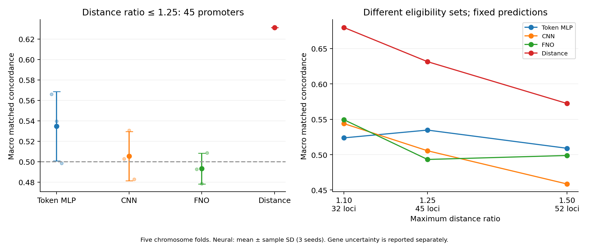

# 거리 통제 CRISPR 후보 순위: MLP·CNN·FNO 비교 결과

**현재의 frozen DNABERT-2 구간별 FNO augmentation에서 추가 이득을 확인하지 못했다.** 같은 promoter의 거리가 비슷한 후보를 비교한 주요 점수는 FNO **0.4932 ± 0.0150**, CNN **0.5055 ± 0.0241**, token MLP **0.5347 ± 0.0340**, 거리 단독 **0.6314**였다. FNO 대비 비교의 95% 구간은 모두 0을 포함했다. 따라서 FNO의 우위도, 모든 대안과의 동등성이나 확정적인 열등성도 입증한 결과는 아니다. 연구 우선순위 관점에서는 이 구조의 추가 튜닝을 여기서 중단할 근거로 판단한다.

신경망 **105회 학습**, 거리 모델 **5회 fit**, 최종 **50회 평가**를 완료했다. 사전 고정한 [프로토콜](MATCHED_CV_PROTOCOL.md)에 따라 전체 학습·모델 선택이 끝난 뒤 test 점수를 계산했다. 실험 ID는 `5baae40be4cfbab57276ebe582cbb7f8acb1da8b98dc576b0faf5c74f6979ce9`다.

## 주요 결과

K562 CRISPR 10,273행(양성 470행)을 5개 chromosome fold로 나눴다. 각 outer-test fold의 모델은 다른 한 fold를 dev로, 나머지 세 fold를 train으로 사용했다. 각 행의 최종 out-of-fold 예측은 그 chromosome이 학습·검증에 없던 모델에서만 얻었다. 기존에 관찰한 데이터를 재사용했으므로 **탐색적 교차 평가이며 새로운 외부 검증이 아니다.**

주요 평가 대상은 같은 promoter 안에서 양성·음성 후보의 거리 최대/최소 비율이 1.25 이하인 **45개 promoter·45개 gene, 397개 비교**다. 양성 행 81개와 음성 행 196개가 포함되며, 후보가 여러 비교에 재사용된다. 397개를 독립 표본으로 취급하지 않았다.

각 비교에서 양성 점수가 높으면 1, 낮으면 0, 동점이면 0.5를 부여했다. Promoter별 평균을 먼저 구하고, 45개 promoter에 같은 가중치를 주었다. 이 **거리 통제 concordance**는 일반 AUROC와 구별한다. 아래 신경망은 모두 동일한 enhancer·promoter 서열과 거리 정보를 사용한다. ±는 세 seed의 표본 SD이며 gene 표본의 신뢰구간이 아니다.

| 모델 | 거리 통제 concordance, 비율 ≤ 1.25 |
|---|---:|
| Token MLP + 거리 | 0.5347 ± 0.0340 |
| CNN + 거리 | 0.5055 ± 0.0241 |
| FNO + 거리 | 0.4932 ± 0.0150 |
| 거리 단독 | 0.6314 |

| 비교 | 평균 차이 | Gene bootstrap 95% 구간 |
|---|---:|---:|
| FNO − CNN | −0.0123 | [−0.0680, +0.0449] |
| FNO − MLP | −0.0415 | [−0.1010, +0.0198] |
| FNO − 거리 | −0.1382 | [−0.2824, +0.0084] |
| CNN − MLP | −0.0292 | [−0.0826, +0.0190] |
| MLP − 거리 | −0.0967 | [−0.2423, +0.0525] |

동일 gene의 모델 간 차이를 유지하는 paired bootstrap 10,000회(seed 20260918)를 사용했다. 각 gene의 세 seed 평균 차이를 구한 뒤 45개 gene을 복원 추출했다. 이 구간은 고정된 학습 결과에 조건부이며, 공유 학습 자료로 인한 fold 간 상관·재학습·chromosome 선택의 불확실성을 모두 반영하지 않는다. 다중 비교 보정도 하지 않았다. 점추정상 거리 단독이 가장 높지만, FNO가 거리 단독보다 통계적으로 열등하다고 확정할 수는 없다.



왼쪽 오차막대는 seed SD다. 오른쪽은 조건마다 평가 가능한 promoter 집합이 달라지는 민감도 분석이며, 같은 집합에서 거리를 조작한 실험이 아니다.

## 거리 조건과 일반 후보 순위

학습이나 설정을 바꾸지 않고 같은 OOF 예측에 사전 지정한 거리 조건을 적용했다.

| 모델 | 비율 ≤ 1.1: 32 promoter, 214 비교 | 비율 ≤ 1.5: 52 promoter, 595 비교 | 거리 제한 없는 123 mixed-label promoter의 macro AUROC |
|---|---:|---:|---:|
| Token MLP + 거리 | 0.5237 ± 0.0125 | 0.5090 ± 0.0162 | 0.6631 ± 0.0324 |
| CNN + 거리 | 0.5439 ± 0.0212 | 0.4586 ± 0.0099 | 0.6763 ± 0.0184 |
| FNO + 거리 | 0.5494 ± 0.0313 | 0.4988 ± 0.0251 | 0.6570 ± 0.0278 |
| 거리 단독 | 0.6797 | 0.5723 | 0.8249 |

가장 엄격한 1.1 조건에서 FNO의 평균이 두 신경망보다 조금 높아지지만, 주요 조건에서는 유지되지 않고 거리 단독보다도 낮다. 이를 근거로 유리한 조건을 골라 FNO의 성공을 주장하지 않는다. 각 조건의 잔여 거리 차이가 남아 있어 거리 단독도 0.5를 넘을 수 있다. 이 결과만으로 잔여 거리 효과의 인과적 크기를 추정하지 않는다.

## 비교 조건과 GPU 비용

고정 revision의 DNABERT-2로 enhancer와 promoter의 1kb reference DNA를 **각각 독립 인코딩**했다. BPE offset의 겹치는 bp 수를 이용해 100개 10bp bin으로 float32 평균한 동일 cache를 세 모델이 공유했다. Encoder는 BF16, FFT는 float32/complex64였다. 6,075개 고유 서열의 token 수는 160–234이며 잘린 서열은 없었다.

각 구간의 residual adapter와 mean pooling 뒤 두 벡터를 결합하고, train fold에서만 표준화한 log10(distance)를 공통 classifier에 입력했다. MLP는 위치 간 추가 mixing이 없는 token별 residual control이다. CNN은 circular kernel 9, FNO는 Fourier modes 16을 사용했다. 동일한 classifier 초기값과 약 23.7만 개의 학습 parameter를 맞췄지만, width가 달라 완전한 단일 요인 비교는 아니다. 이전 pooled-vector MLP나 BPE mean 실험과 점수를 직접 전후 비교하지 않는다.

모델·fold마다 LR 0.0001/0.0003/0.001 × seed 42/43을 동일하게 탐색하고, dev의 거리 통제 concordance로 checkpoint와 LR을 선택했다. 선택 LR에 seed 44를 추가했다. 동일한 최대 20 epoch와 early stopping을 사용했으며, 실제 epoch 수는 모델별로 달랐다. 거리 모델은 train에만 fit한 balanced logistic regression(C=0.001)이다. 구조 후보 탐색과 full fine-tuning은 이번 비교에 포함되지 않는다.

| 모델 | Width | 학습 parameter | 35 trial의 실제 총 epoch | 학습 시간 합계 | 평균 학습 초/epoch | Peak allocated MiB |
|---|---:|---:|---:|---:|---:|---:|
| Token MLP | 79 | 238,160 | 305 | 303.64초 | 0.996 | 1,959.36 |
| CNN | 62 | 237,921 | 323 | 334.07초 | 1.034 | 1,957.87 |
| FNO | 44 | 235,587 | 296 | 315.84초 | 1.067 | 1,957.83 |

NVIDIA RTX 5060 Ti에서 실행했다. 전체 runner 경과 시간은 **1,188.48초(19.81분)**이며 사후 검증·보고서 작성 시간은 제외한다. Encoder 특징 추출은 33.68초, 해당 단계 peak allocated memory는 543.21MiB였다. 위 학습 메모리는 GPU의 고정 grid cache를 포함한다. 학습 시간 합계는 dev·checkpoint 저장 등 전체 overhead를 포함하지 않으며, fold마다 학습 행 수가 달라 초/epoch를 엄밀한 속도 우위로 해석하지 않는다.

Cache 기반 평가의 행 처리율은 MLP 11,991.6, CNN 11,918.2, FNO 11,561.9행/초였다. 여기에는 순위 지표 계산과 CPU 작업이 포함되고 DNABERT 인코딩은 제외되므로, 전체 추론 성능이나 긴 서열 scaling benchmark로 사용할 수 없다. 상세 수치는 [비용 기록](matched_cv_results/cost_summary.json)에 있다.

## 검증과 남는 한계

38개 테스트가 통과했다. 저장 예측으로 지표를 재계산하고, 45개 신경망 checkpoint와 5개 거리 모델을 다시 실행해 50개 평가의 확률을 재현했다. Source·code·cache·checkpoint hash, 거리 비교 구성, chromosome/gene/동일 서열 및 reverse-complement의 fold 간 분리, 학습 fold 정규화와 class weight, dev 전용 모델 선택, 동일한 classifier 초기값을 검증했다. 각 모델·seed의 10,273행이 OOF 예측에 정확히 한 번씩 포함되는 것도 확인했다. [검증 기록](matched_cv_results/verification.json)과 [테스트 기록](matched_cv_results/setup_checks.json)에 결과를 남겼다.

데이터는 [앞선 CRISPR 실험](CRISPR_RANKING_RESULTS.md)에서 검증한 GRCh38 좌표·reference DNA를 재사용했다. Assay 음성은 생물학적 효과가 전혀 없다는 보장이 아니며, 입력에 K562 특이 변이·염색질 상태·enhancer–promoter 사이의 실제 DNA가 포함되지 않는다. 이 실험은 각 1kb 구간 안의 augmentation을 평가했으므로 **장거리 연속 유전체에서 FNO를 backbone으로 사용하는 가설을 검증한 것은 아니다.**

주요 dev promoter는 fold마다 9개로 작다. 현재의 제한된 LR 탐색과 고정 구조 아래 얻은 결과이며, FNO 일반 또는 모든 튜닝 방식에 대한 결론으로 확장하지 않는다. 신경망에 거리를 입력했다고 해서 거리 기준선의 순위가 자동으로 보존되는 구조도 아니다. 현재 결과는 이 세 가지 결합 방식에서 서열 mixer의 추가 이득을 확보하지 못했다는 뜻이다.

이번 추가 비교까지 종합하면, 현재의 frozen DNABERT-2 뒤에 FNO를 붙이는 방향은 **성능 향상을 근거로 계속 확대하기 어렵다.** 같은 자료에서 seed·폭·mode를 계속 늘리기보다 결과를 정리하고 현재 방향의 추가 튜닝을 중단하는 것이 합리적이다. 연속 장거리 DNA나 다른 backbone을 다루는 연구는 별도의 가설과 평가 설계가 필요한 새 연구로 구분한다.

## 재현 파일

- [사전 프로토콜](MATCHED_CV_PROTOCOL.md), [설정](../configs/matched_cv.json), [학습 runner](../scripts/run_matched_cv.py), [검증·집계 코드](../scripts/report_matched_cv.py)
- [OOF 요약·bootstrap](matched_cv_results/oof_summary.json), [전체 OOF 예측](matched_cv_results/oof_predictions.csv), [promoter별 점수](matched_cv_results/per_promoter_concordance.csv)
- [학습률 선택](matched_cv_results/selection.json), [data 출처·fold 구성](matched_cv_results/data_source.json), [export SHA-256 manifest](matched_cv_results/export_manifest.json)

```powershell
.\.venv\Scripts\python.exe scripts/run_matched_cv.py
.\.venv\Scripts\python.exe scripts/report_matched_cv.py
```

완료된 runner는 재학습하지 않고 종료한다. Checkpoint와 전체 실행 기록은 `runs/matched_cv/`에 보관했다. 공용 study의 legacy 필드 `best_dev_mcc`에는 이 실험에서 선택한 `matched_concordance`가 저장되며, MCC로 선택한 것이 아니다.
