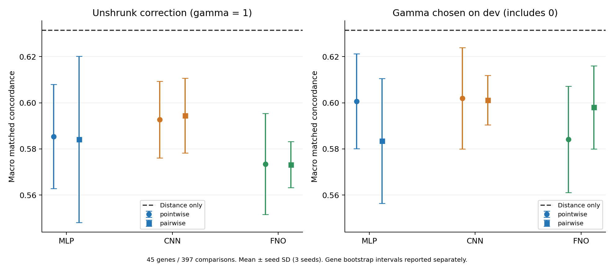

# 고정 거리 모델 + 서열 보정: 순위 loss 진단 결과

**순위 loss로 바꿔도 거리 기준선 대비 추가 이득이나 FNO의 고유 이득을 확인하지 못했다.** 보정 강도를 dev에서 선택한 주요 결과는 pairwise FNO **0.5980 ± 0.0180**, pairwise CNN **0.6012 ± 0.0107**, 거리 단독 **0.6314**였다. 동일 FNO에서 pairwise−pointwise 차이는 **+0.0139 [−0.0363, +0.0627]**이고, 보정을 그대로 적용한 gamma=1에서는 **−0.0003 [−0.0504, +0.0482]**였다. 이번 조건에서는 분류 loss 대신 순위 loss를 쓰는 것이 해결책이라는 근거를 얻지 못했다.

사전 고정한 [프로토콜](RESIDUAL_RANK_PROTOCOL.md)에 따라 **90회 신경망 학습·95개 fold별 모델 평가**를 완료했다. 5개 거리 기준 모델은 기존 train-fold fit을 고정해 재사용했다. 실험 ID는 `4534b8d293db24b58adbf9f31665055e96f4a5c9641ade8b24c310336ff83ca2`다. [검증 기록](residual_rank_results/verification.json)에서 모든 예측의 재현을 확인할 수 있다.

## 무엇을 비교했는가

기존 K562 CRISPR 10,273행과 5개 chromosome fold, frozen DNABERT-2의 동일한 10bp grid cache를 재사용했다. Outer test=f, dev=(f+1)%5, 나머지 세 fold가 train이다. 평가 대상은 같은 promoter에서 거리 비율이 1.25 이하인 **45개 promoter·45개 gene의 397개 양성–음성 비교**다. 각 promoter의 평균을 먼저 계산한 후 45개에 같은 가중치를 준 concordance를 사용한다. 동점은 0.5다. 397개 비교에는 후보 재사용이 있으므로 독립 표본 수로 취급하지 않는다.

예측은 `고정 거리 logit + gamma × 서열 보정`이다. 보정 모델은 enhancer와 promoter의 각 1kb 서열 표현만 입력받고 거리는 입력받지 않는다. MLP/CNN/FNO mixer와 공통 head를 사용하며, 마지막 Linear를 0으로 초기화해 최초 예측이 거리 모델과 정확히 같도록 했다.

학습 목표의 효과를 분리하기 위해 **두 loss 모두 같은 train-fold matched pair와 같은 promoter 가중치**를 사용했다. Pairwise는 양성 점수가 음성보다 높아지게 학습하고, pointwise 대조군은 같은 두 후보를 양성/음성으로 분류하도록 학습했다. 각 trial의 보정 학습 대상은 train의 27개 주요 promoter다. 거리 기준 모델은 원래 train 전체 행에 fit된 모델이다.

3개 mixer × 2개 loss × 5개 fold × 3개 seed, 총 90회 학습했다. LR 0.0003을 고정하고 최대 40 epoch, patience 8, pair batch 16 × accumulation 2를 사용했다. 동일 fold/seed에서 초기 가중치와 pair 순서를 맞췄다. Dev에서 gamma=1의 concordance로 checkpoint를 선택한 뒤, gamma 0/0.25/0.5/1 중 concordance가 가장 높은 값을 선택했다. 동점이면 작은 gamma를 택했다. 모든 모델 선택이 끝난 다음 test를 평가했다.

## 주요 점수

±는 3개 seed의 표본 SD다. 각 seed의 점수는 5개 held-out fold의 예측을 모아 계산했다. Dev-selected gamma가 사전 지정한 주요 사용 규칙이고, gamma=1은 보정을 그대로 적용했을 때의 진단 결과다. Gamma=0이면 해당 fold/seed에서 거리 모델로 되돌아간다.

| 보정 모델 | Loss | Gamma=1 | Dev-selected gamma | Gamma=0 선택 수 / 15 |
|---|---|---:|---:|---:|
| MLP | Pointwise | 0.5854 ± 0.0226 | 0.6007 ± 0.0205 | 7 |
| MLP | Pairwise | 0.5841 ± 0.0360 | 0.5835 ± 0.0271 | 7 |
| CNN | Pointwise | 0.5927 ± 0.0166 | 0.6020 ± 0.0219 | 4 |
| CNN | Pairwise | 0.5945 ± 0.0163 | 0.6012 ± 0.0107 | 8 |
| FNO | Pointwise | 0.5734 ± 0.0219 | 0.5841 ± 0.0231 | 6 |
| FNO | Pairwise | 0.5732 ± 0.0100 | 0.5980 ± 0.0180 | 8 |
| 거리 단독 | 고정 기준선 | 0.6314 | 0.6314 | — |

FNO 순위 모델은 15개 fold/seed 중 **8개에서 보정을 끄는 gamma=0**이 선택됐다. 이를 8개의 독립 성공·실패 사례로 해석하지 않는다. Dev에서 baseline으로 되돌아갈 선택지를 넣어도 test 성능 보존은 보장되지 않았고, 주요 점추정은 모든 보정 모델이 거리 단독보다 낮았다.



오차막대는 seed SD이며 아래 gene bootstrap 신뢰구간과 다르다. 두 패널은 같은 y축 범위를 사용한다.

## 차이와 불확실성

아래는 **dev-selected gamma**의 사전 지정 대비다. 45개 gene의 seed 평균 점수를 paired bootstrap 10,000회 복원 추출한 95% percentile 구간이다.

| 비교 | 차이 | 95% 구간 |
|---|---:|---:|
| Pairwise FNO − pairwise CNN | −0.0031 | [−0.0250, +0.0169] |
| Pairwise FNO − pairwise MLP | +0.0146 | [−0.0074, +0.0412] |
| Pairwise FNO − 거리 단독 | −0.0333 | [−0.1111, +0.0436] |
| MLP: pairwise − pointwise | −0.0172 | [−0.0602, +0.0249] |
| CNN: pairwise − pointwise | −0.0008 | [−0.0398, +0.0425] |
| FNO: pairwise − pointwise | +0.0139 | [−0.0363, +0.0627] |
| Pairwise MLP − 거리 단독 | −0.0479 | [−0.1211, +0.0176] |
| Pairwise CNN − 거리 단독 | −0.0302 | [−0.1097, +0.0481] |

보정을 그대로 적용한 **gamma=1**에서 loss만 바꾼 차이도 작았다.

| 모델의 pairwise − pointwise | 차이 | 95% 구간 |
|---|---:|---:|
| MLP | −0.0012 | [−0.0452, +0.0429] |
| CNN | +0.0018 | [−0.0407, +0.0477] |
| FNO | −0.0003 | [−0.0504, +0.0482] |

사전 지정한 모든 raw/selected 대비의 구간이 0을 포함했다. 따라서 개선을 확인하지 못했지만 loss 간 동등성이나 거리 모델에 대한 확정적 열등성을 입증한 것은 아니다. 구간은 고정된 학습 모델에 조건부이며, 공유 train으로 인한 fold 간 상관·재학습·chromosome 선택의 불확실성을 모두 포함하지 않는다. 다중 비교 보정도 하지 않았다. [전체 대비 표](residual_rank_results/TABLES.md)와 [원 수치](residual_rank_results/oof_summary.json)에 gamma=1의 나머지 대비까지 보관했다.

## 민감도 분석

선택된 gamma와 OOF 예측을 바꾸지 않고 다른 거리 조건을 적용했다. 조건별 평가 가능한 promoter 집합이 달라진다. Macro AUROC는 거리 제한 없이 모든 123개 mixed-label promoter 안의 순위를 평가한 보조 지표다.

| 보정 모델 / loss | 비율 ≤ 1.1: 32 promoter | 비율 ≤ 1.5: 52 promoter | 제한 없는 macro AUROC |
|---|---:|---:|---:|
| MLP / pointwise | 0.6004 ± 0.0040 | 0.5386 ± 0.0279 | 0.8061 ± 0.0257 |
| MLP / pairwise | 0.5965 ± 0.0125 | 0.5256 ± 0.0364 | 0.8145 ± 0.0097 |
| CNN / pointwise | 0.5879 ± 0.0249 | 0.5402 ± 0.0156 | 0.8102 ± 0.0139 |
| CNN / pairwise | 0.6222 ± 0.0132 | 0.5455 ± 0.0140 | 0.8144 ± 0.0082 |
| FNO / pointwise | 0.5812 ± 0.0126 | 0.5247 ± 0.0209 | 0.8226 ± 0.0043 |
| FNO / pairwise | 0.6011 ± 0.0225 | 0.5379 ± 0.0324 | 0.8185 ± 0.0055 |
| 거리 단독 | 0.6797 | 0.5723 | 0.8249 |

민감도 분석의 평균에서도 거리 단독을 넘지 못했다. 이 보조 조건의 결과를 보고 모델을 다시 선택하지 않았다. 주요 순위 계산은 float64 logit score를 사용한다. 순위 loss는 공통 logit 이동을 식별하지 못하므로 출력 sigmoid를 calibrated probability로 해석하지 않는다.

## 비용과 재현 검증

NVIDIA RTX 5060 Ti에서 고정 DNABERT 특징을 재사용했다. Runner 내부의 자료 로딩·학습·평가 측정 시간은 **118.09초**였다. 이 수치는 시작 시의 환경 로딩·hash 검사와 사후 검증·보고서 작성을 제외한다. 이전에 만들어 둔 encoder cache를 사용했으므로 end-to-end 재학습 시간도 아니다.

| 모델 / loss | 학습 parameter | 15 trial의 총 epoch | Fit 시간 합계: dev 포함 | Peak allocated MiB |
|---|---:|---:|---:|---:|
| MLP / pointwise | 238,031 | 215 | 16.35초 | 1,960.20 |
| MLP / pairwise | 238,031 | 182 | 13.69초 | 1,960.20 |
| CNN / pointwise | 237,792 | 208 | 17.24초 | 1,957.86 |
| CNN / pairwise | 237,792 | 184 | 14.53초 | 1,957.86 |
| FNO / pointwise | 235,458 | 210 | 18.43초 | 1,957.82 |
| FNO / pairwise | 235,458 | 196 | 15.82초 | 1,957.82 |

메모리는 공유 GPU grid cache를 포함한다. Epoch 수와 fold별 pair 수가 달라 이 시간으로 엄밀한 처리 속도 우위를 주장하지 않는다. 상세 값은 [비용 기록](residual_rank_results/cost_summary.json)에 있다.

**테스트 41개가 통과했다.** Zero 초기 출력, pairwise loss의 공통 이동 불변성 및 gradient 방향, pointwise BCE 대조 계산, promoter별 동일 총 가중치, gamma=0 선택, mixer gradient를 확인했다. 사후 검증에서 90개 신경망의 dev/test 보정을 다시 계산한 test 보정 최대 절대 차이는 **0.0**이었다. 5개 고정 거리 모델, source/code/cache/checkpoint hash, train-fold 정규화, 모든 checkpoint·gamma 선택, chromosome/gene/동일 및 RC 서열 분리, OOF 행의 중복·누락도 검증했다. 각 arm/seed/mode에 10,273개의 OOF score가 있다.

## 해석과 종료 판단

이번 비교에서 순위 loss의 안정적인 이득을 확인하지 못했으므로, 이전 성능 저하를 단순히 “분류 loss로 학습했기 때문”이라고 설명할 근거는 없다. 다만 작은 matched-pair 학습 집합과 하나의 고정 학습률에서 얻은 결과이므로 가능한 모든 ranking 학습 방식을 배제하지는 않는다.

이전 FNO의 0.4932보다 이번 selected pairwise FNO의 0.5980이 높아 보이지만, 고정 거리 offset·zero 초기화·학습 후보 구성·head·보정 강도 선택이 함께 달라졌다. **이 전후 차이를 순위 loss의 개선 효과로 해석하면 안 된다.** Loss에 관한 결론은 이번에 같은 조건으로 새로 학습한 pointwise와 pairwise의 비교에서 얻는다.

자료와 설정을 여러 차례 관찰했으므로 이번 결과도 탐색적 OOF 진단이다. 새로운 외부 데이터에서 확인된 결과가 아니다. FNO는 각 1kb 구간 안에서만 작동했으며, 두 구간 사이의 연속 DNA나 cell-state 정보를 사용하지 않았다.

이번 진단까지는 **현재 CRISPR 자료와 frozen 구간 표현에 대한 추가 튜닝을 종료하는 판단**을 지지한다. 장거리 FNO의 가능성은 별도의 연속 서열·원거리 정보 의존성 실험에서 다룰 질문이며 이번 실행에는 포함하지 않았다.

## 파일과 실행

- [설정](../configs/residual_rank.json), [모델·loss](../scripts/residual_rank_models.py), [runner](../scripts/run_residual_rank.py), [검증·집계](../scripts/report_residual_rank.py)
- [OOF score](residual_rank_results/oof_scores.csv), [promoter별 점수](residual_rank_results/per_promoter.csv), [90개 학습·선택 기록](residual_rank_results/training_complete.json)
- [테스트 기록](residual_rank_results/setup_checks.json), [export manifest](residual_rank_results/export_manifest.json), [이전 mixer 비교](MATCHED_CV_RESULTS.md)

```powershell
.\.venv\Scripts\python.exe scripts/run_residual_rank.py
.\.venv\Scripts\python.exe scripts/report_residual_rank.py
```

완료된 runner는 재학습하지 않는다. Checkpoint는 `runs/residual_rank/trials/`에 보관한다.
