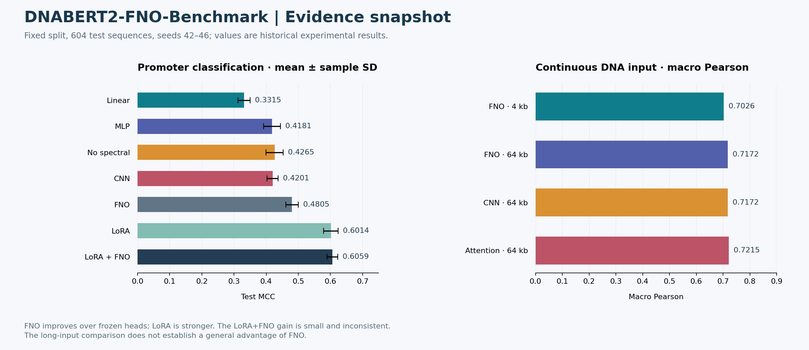

# DNABERT2-FNO-Benchmark: 실험 결과와 진행 상태

이 문서는 공개본에 보존된 실험·검증 기록을 시각화한 것이다. 원래 학습·과학 실험을 새로 수행했다는 의미는 아니다. 기능 테스트, 합성 데모, 실제 성능 지표를 서로 구분한다. 진행률의 임의 퍼센트는 사용하지 않는다.



## 결과 해석

FNO는 frozen 비교군보다 높은 MCC를 기록했지만 LoRA가 더 강한 비교군이었다. LoRA+FNO의 평균 추가 이득은 +0.0045 ± 0.0170이며 5개 seed 중 3개에서만 개선됐다. 64 kb 입력에서도 attention·CNN과의 비교를 함께 봐야 한다.

## 현재 진행 상태

| 항목 | 확인된 상태 |
|---|---|
| 모델·비교군 | 구현 및 기존 실험 기록 확보 |
| 공개본 검증 | 46개 테스트 통과 |
| 전체 학습 재실행 | 이번 문서 작업에서 미실행 |
| 외부 일반화 | 데이터·split·예산에 따른 추가 검증 필요 |

## 다음 보완 과제

1. 추가 데이터셋과 독립 split에서 강한 비교군을 포함한 재현
2. encoder 추론을 포함한 종단 간 시간·메모리 계측
3. 다중 비교와 개발 단계 선택을 반영한 불확실성 보고

## 보안 범위와 남은 검증

키·개인 경로·대용량 데이터는 공개본에서 제외했다. 모델을 적용할 때 입력 유전체의 이용 권한과 모델 가중치의 정보 노출 가능성은 별도로 검토해야 한다.
`.gitignore` 외에 공개 파일 내용도 검사했다. 이전에 유출된 비밀정보를 ignore 규칙만으로 회수할 수는 없다.

## 근거와 그림 재현

- [docs/COMPARATIVE_RESULTS.md](../../docs/COMPARATIVE_RESULTS.md)
- [docs/CONTINUOUS_RNA_RESULTS.md](../../docs/CONTINUOUS_RNA_RESULTS.md)
- [VALIDATION.md](../../VALIDATION.md)
- [그림의 수치와 조건](metrics.json)
- [확대 가능한 SVG](results.svg)
- [그림 재생성 코드](reproduce_figures.py)

```bash
python -m pip install matplotlib
python docs/portfolio-results/reproduce_figures.py
```

원시 실험 재현은 각 프로젝트의 본문 프로토콜을 따른다. 위 명령은 보존된 수치로 그림만 다시 만든다.
